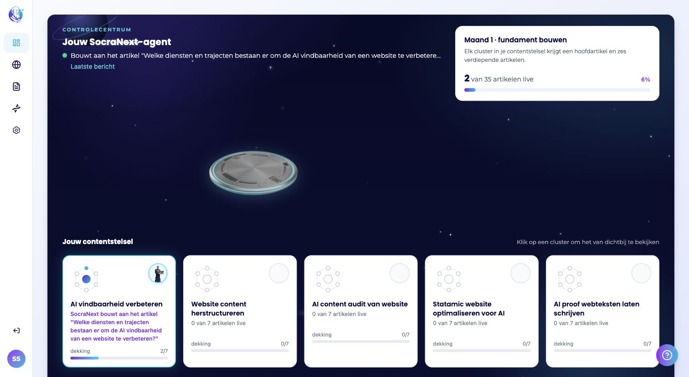
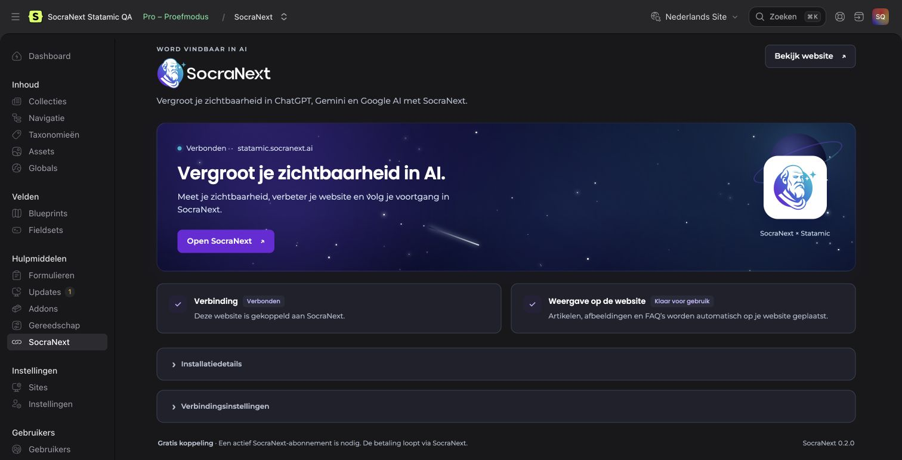
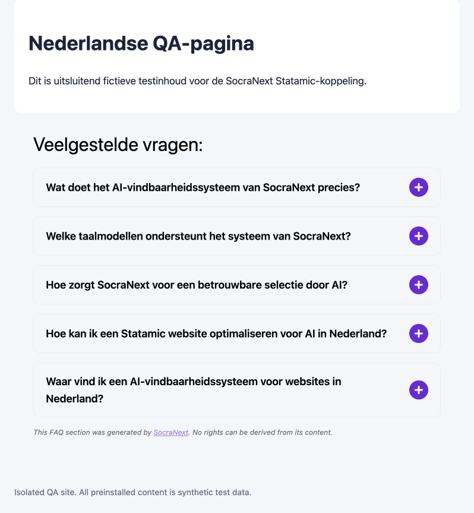

# SocraNext for Statamic

**Get found in AI.** SocraNext helps your website become visible in ChatGPT, Gemini and Google AI. Measure your visibility, improve your website and track your progress, all in one platform. This addon connects your Statamic website to SocraNext.

The addon is free. An active [SocraNext subscription](https://socranext.ai/prijzen/) is required and is billed directly by SocraNext. Statamic 6 Pro and hosting are separate requirements.



*Your SocraNext agent, progress and content clusters in one control center. Example project.*



*Example of a connected website in the Statamic Control Panel.*



*Example of SocraNext's FAQ design, displayed automatically on a Statamic page.*

## Installation

Requirements: Statamic 6 Pro, PHP 8.3–8.5 with Sodium, cURL, DOM, Fileinfo and Mbstring, a public HTTPS website address (`APP_URL`), and persistent writable content, Laravel storage and image storage.

1. Install through your website's normal Composer/deployment process:

   ```sh
   composer require socranext/statamic
   ```

2. Create a Statamic project in SocraNext using the same website address.
3. Open **Tools → SocraNext** in Statamic and select **Connect with SocraNext**.

Connecting automatically prepares the article collection, categories, archive and public image storage. It checks the resulting configuration and enables the supported publication actions. There is no template-editing step or readiness checkbox for a standard native Statamic website. Only a superuser or a user with `configure socranext` may connect or disconnect. The screen follows the user's English or Dutch Control Panel language preference.

Enabled FAQs are added to the native HTML response just before the end of `<main>`, with the end of `<body>` as a fallback. An existing SocraNext FAQ tag or managed-article FAQ keeps its chosen placement and is not duplicated. Explicit SocraNext metadata updates are applied in the page's `<head>`; unrelated structured data is retained. Article, FAQ and archive design comes from SocraNext's own templates and styling editor. The site layout supplies only the surrounding header, navigation and footer; an included standalone layout is used if no compatible native Antlers site layout is available. Template files are never rewritten.

Native public collections are discovered automatically. Protected pages, unpublished entries and collections without public routes are excluded. Empty `content.sites` selects the default site; additional native sites remain an explicit configuration choice. Test the appearance through SocraNext's styling previews and publish a test article when setting up your project, as with your normal website deployment workflow.

### Optional customization

Standard setup does not require a published configuration file or a separate install command. Developers can publish the configuration when choosing different collection handles, image storage, languages or a custom layout:

```sh
php artisan vendor:publish --tag=socranext-config
```

- `site_url` defaults to `APP_URL` and must match the canonical HTTPS address in SocraNext.
- `content.asset_container` can select an existing public Statamic asset container. Otherwise the addon creates `socranext` on its own `socranext_public` disk at `public/socranext-assets`. Keep this directory persistent across releases, along with content and storage. Existing containers and filesystem configuration are retained.
- `content.article_layout` selects a native Antlers or Blade layout. The default follows the native Antlers shell from `statamic.system.layout` (normally `layout`). Default Blade shells use the bundled standalone layout because `@yield` and component slots cannot automatically receive an Antlers article. An explicit Blade layout must output `{!! $template_content !!}`. An explicitly configured missing layout is reported as a setup issue.
- `content.discovery = 'configured'` limits access to the collections explicitly listed in `content.collections`. Automatic discovery classifies other public routed collections as custom content types.
- `content.sites` selects additional native site handles. Before adding non-default sites, complete Statamic's normal `php please multisite` conversion. The addon does not change native multisite storage automatically.
- `frontend.mode = 'manual'` disables automatic output for custom placement or a separately hosted frontend. Use `{{ socranext:faq }}` where the FAQ belongs and `{{ socranext:metadata }}` in the site's `<head>`, or integrate these fields into your existing SEO layer. Only this optional mode shows the readiness confirmation under **Installation details**.

A separate headless/static frontend needs its own rendering and deployment integration: the addon cannot modify HTML served by another application. Native full-page Statamic responses are supported; arbitrary Laravel controllers, response fragments and custom access-control middleware require a project-specific integration.

For diagnostics or explicit command-line initialization:

```sh
php please socranext:doctor --json
php please socranext:install
```

The installer rejects collisions and never adopts or replaces existing customer resources. Reconnecting validates completed installations without recreating intentionally removed resources. Resolve a reported conflict or missing write permission through the site's normal development process.

Install and update through the website's normal Composer/test/deploy process. Statamic 6 provides Composer commands in its control panel, rather than executing package installation there. The standard installation/update hook publishes only SocraNext Control Panel assets to `public/vendor/socranext`. If deployment skips Composer scripts, run `php artisan vendor:publish --tag=socranext-assets --force`. Logos and fonts are served locally; font license notices are included in [THIRD_PARTY_NOTICES.md](THIRD_PARTY_NOTICES.md).

## Integration boundaries

API base: `/api/socranext/v1`. Authentication uses `x-socranext-token` or a Bearer token. Conflicting credentials are rejected. Tokens are delivered directly from the trusted SocraNext backend using a short-lived, single-use state created in the authorized control panel; the addon stores only hashes. Disconnect revokes the credential and preserves content.

The addon exposes native content for selection, and writes articles into its owned collection. It preserves unrelated fields and never attempts to flatten arbitrary customer Bard or Replicator structures into article HTML. FAQ placement on native pages is automatic, with optional template tags for custom placement. Browser-only package installation and a universal SEO/page-builder integration are outside this supported profile.

Global custom JavaScript must carry a valid SocraNext Ed25519 signature bound to the website and the slot. Per-page unsigned JavaScript is rejected. Preview sessions are short-lived and restricted to configured platform origins. Only public HTTPS image downloads are allowed, with pinned DNS, no redirects, MIME validation and a size limit.

`GET /status` advertises the contract version, addon version, readiness and supported capabilities. The platform must check those capabilities instead of assuming that every CMS supports every optional action. Native article translations and translated styling are supported, with distinct identities for each Statamic site. The platform worker enables them only after capability and website-readiness checks.

The connector does not support category slug changes, generation requests initiated from the CMS, and bulk translated archive-slug maps. Category title and description edits, native entry slug changes, native multilingual articles and translated styling are supported. Each site can have its archive slug configured through the API. A rejected operation returns an error; it is never reported as a successful publication.

## Subscription and privacy

Your subscription and payments are managed by SocraNext. After the subscription ends, published blog articles remain on your website. SocraNext schedules removal of its FAQs after 14 days; the payment-freeze deadline is 28 days after the freeze. Reconnection and an active subscription allow FAQs to be synchronized again from SocraNext. Disconnecting in Statamic revokes the connection and does not cancel your subscription.

The connection gives SocraNext access to native public content in the connected site, or your configured collection allowlist, and permission to manage its supported articles, FAQs, metadata and styling. It does not create a Statamic administrator account. The addon stores connection-token hashes locally; the connected cloud service processes website content to provide SocraNext's features. See the [service description](docs/statamic-service-terms.md), [general terms](https://socranext.ai/algemene-voorwaarden/) and [privacy policy](https://socranext.ai/privacybeleid/).

## Durable identities and recovery

The platform retains its existing numeric article and category columns. The addon maps native Statamic IDs plus site identity to stable positive 52-bit numeric IDs, detecting rather than accepting a collision. This avoids a global database identity migration affecting WordPress, Shopify or Headless.

Back up `storage/app/private/socranext/` **together with content, revisions and assets**. It contains the identity registry, publication journal, connection hash, FAQ data and styling. Keep it persistent across deploys. Production workers must share storage with reliable file locks; independent local disks are not supported. The registry is not a disposable cache.

Publication uses a stable `blogId` and a journal to avoid duplicate native entries on retries. Native revisions and fingerprints protect live content and detect changes made in Statamic. Explicit deletion and bulk purge are ownership-scoped. A purged binding can be restored only through an explicit restore request; ordinary delayed writes must not resurrect deleted content. Assets are retained because customer pages may share them.

## Development and validation

```sh
composer install
composer test
node --test tests/JavaScript/*.test.mjs
```

Tests boot an actual Statamic 6 application through Testbench, with Laravel's real global input normalizers enabled. CI explicitly tests Laravel 12 with Testbench 10/PHPUnit 11 and Laravel 13 with Testbench 11/PHPUnit 12, each on PHP 8.3, 8.4 and 8.5. Every matrix job resolves its own compatible dependencies. Tests cover authentication, native permissions, content identities/publication, cold file reloads and editor conflicts, multisite configuration, FAQ rendering, exact signed code/text payloads and previews. Additional platform tests protect the existing CMS branches. No deployment, shared database migration or production website writes are part of running this suite.

Connector JSON preserves whitespace and empty strings so code signatures, `llms.txt` and explicit style clearing survive Laravel's global middleware. That exception applies only to the addon's JSON API; native website forms and the Statamic control panel retain their existing input handling. Content conflict detection uses Statamic's persisted representation, including blueprint resolution, root empty-value removal and front-matter parsing. Explicit empty translation overrides remain distinct from inherited values.

Release validation covers CI on the exact commit, anonymous installation, upgrades, the hosted SocraNext workflow and public output. The [release checklist](docs/marketplace-release.md) records package verification and Marketplace submission separately.

Software distribution and use are governed by [LICENSE](LICENSE). The [Statamic service description](docs/statamic-service-terms.md) explains the connection and offboarding behavior under the applicable SocraNext agreement.

See the [changelog](CHANGELOG.md) and [Marketplace release checklist and draft](docs/marketplace-release.md). Report addon issues through the public [issue tracker](https://github.com/SocraNext/socranext-statamic/issues); account and billing questions can go to [info@socranext.ai](mailto:info@socranext.ai).
